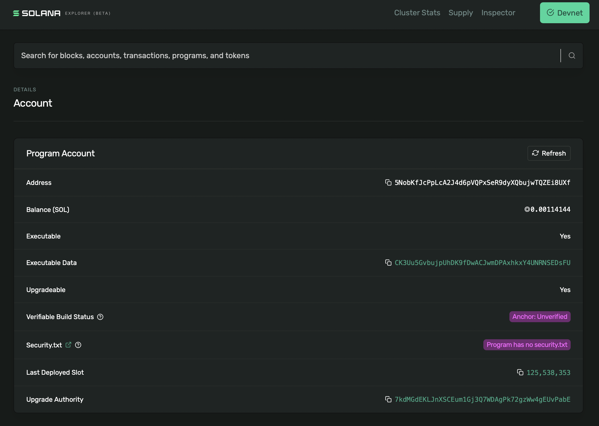
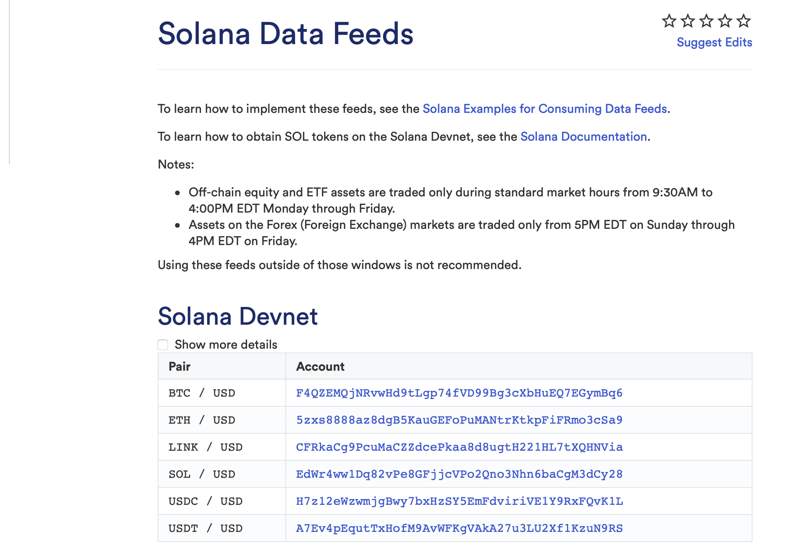
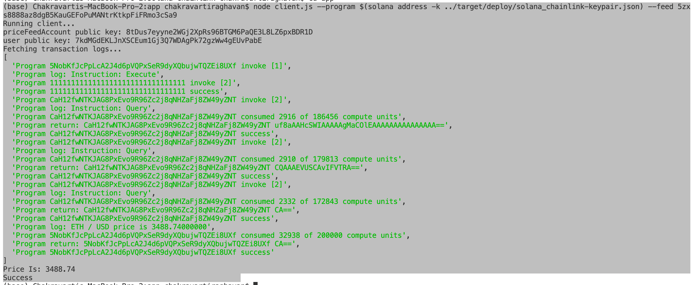

# Solana Smart Contract to Read ChainLink Data feed

## Anchor, VS Code, Solana blockchain, ChainLink Oracles, Rust

Created, deployed and interacted with a solana program that will consume data from a Chainlink Data Feed. The program will take an account (to store the price data), and a Chainlink Data Feed account, then it will read the latest price from the data feed, and store the value in the first account.

Created new project using the Anchor CLI

Deployed on Solana DevNet

## Smart contract Solana Program

Created a new Rust program that takes in a ‘consumer’ account, as well as a chainlink data feed account, and the account of the chainlink data feeds program, and it will obtain the latest price of the specified data feed, and store the result in the specified consumer account.

1. Defines a new anchor program
2. Creates an Decimal struct that defines how the price data is stored in the specified consumer account
3. Defines a fmt function for formatting price data with the correct decimals and zeros etc
4. Defines a new ‘execute’ function, which takes the following as inputs:
   1. The consumer account to store the price data
   2. The specified chainlink data feed account (eg SOL/USD) to obtain price data from
   3. The chainlink price feeds program account on Devnet
5. Defines the execute function body, which performs the following:
   1. Calls the `get_latest_round_data`, `description` and `decimals` functions of the chainlink data feed program for the specified price feed account
   2. Stores the result of the calls above in the specified consumer account via the Decimal struct
   3. Prints out the latest price to the program log output
6. Defines the execute function context, and what accounts are expected as input when it’s called

Built and deployed the Solana Program:

## Client program 

Then created the Client program:

1. Takes two parameters from the command line:
   1. Program - the program ID of our deployed program
   2. Feed - the chainlink data feed account that we want to obtain price data from
2. Uses the passed in program ID parameter, and the generated IDL file for the program, creates a connection to the deployed program
3. Generates a new keypair to be used for storing the price data
4. Calls the ‘execute’ instruction on the deployed program, passing in the account to store the price data in in, the user account paying for the transaction fees, the Chainlink data feed account address of the data feed we are obtaining price data from, the Chainlink Price Feeds program on Devnet, and the system program ID. We also sign the transaction with the account storing the price data
5. Prints out the program log messages obtained once the transaction is confirmed
6. Obtains the latest price data stored in the consumer account that was passed into the program, and prints the value to the console

Then running the client:

there are different feeds:https://docs.chain.link/docs/solana/data-feeds-solana/

Below ETH price is retrieved:

